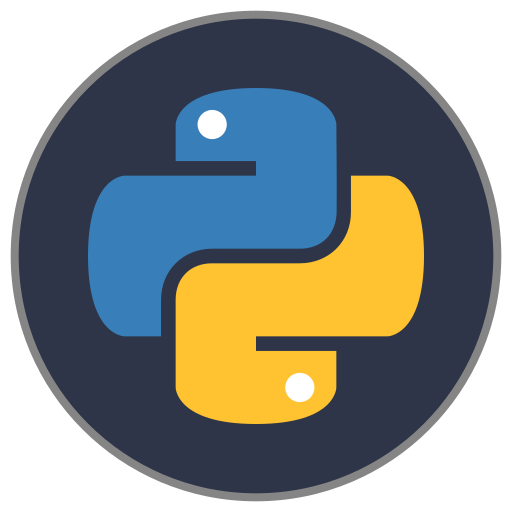
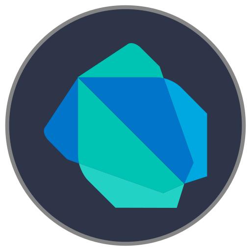
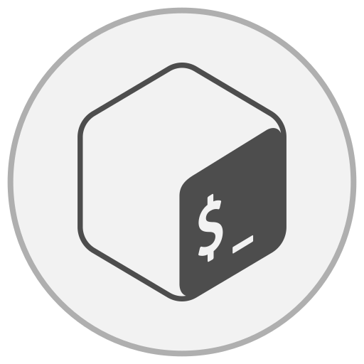
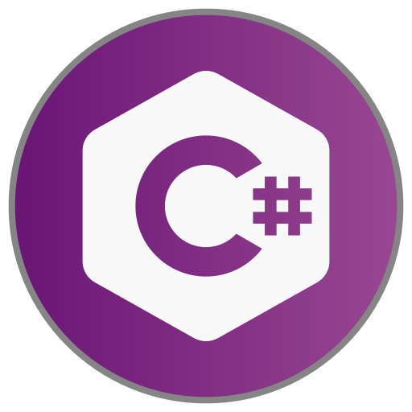

# ICONIC

> Be iconic, not generic.  
> A dev-focused library of sleek, bubble-shaped skill icons built for GitHub READMEs, portfolios, and resumes.

---

## ✨ Features

-   🟦 Bubble icons designed for clarity and aesthetics
-   🌙 Light & dark theme variants for every icon
-   🧩 Easy to embed in Markdown, HTML, or anywhere
-   ⚙️ HTML preview API with Django backend
-   💾 Download-ready SVGs

---

## 📁 Folder Structure

```
ICONIC
├── repo config files ( README, workflows, code_of_conduct, etc )
├── icon-templates/
├── icons/
|   ├── dark/
|   │ ├── python.svg
|   │ ├── javascript.svg
|   │ ├── ....
|   └── light/
|     ├── python.svg
|     ├── javascript.svg
|     ├── ....
└── api/
```

---

## 🧪 Quick Preview

Here's a sample of some icons:

```markdown
## Markdown




```

```markdown
## HTML

Everything in oneline to show the icons in oneline
  
```

### Dark:

    

### Light:

   

## 🚀 Getting Started (Dev Setup)

```bash
# Clone the repo
git clone https://github.com/YuheshPandian/ICONIC.git
cd ICONIC
```

---

## 🤝 Contributing

Have a new icon idea or want to help expand the collection?  
Pull requests are welcome!

-   Create your icon using a photo editing software( Inkscape preferred ) and open the dark/light icon template and start editing.
-   Add the dual versions of icon in respective dark/light folders
-   Push the changes if completed

> Please follow the existing folder structure (`dark/` and `light/`), keep icon dimensions consistent (e.g., 512x512 SVG), and use meaningful file names.

---

## 📜 License

[MIT License](LICENSE)

---
