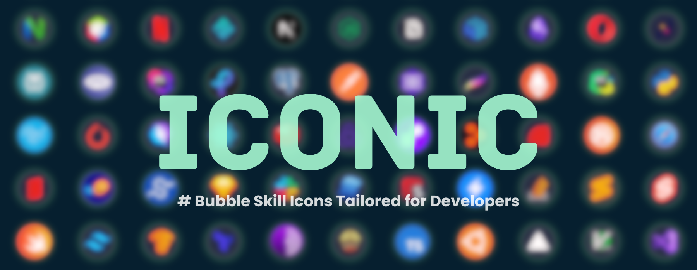

> Be iconic, not generic.  
> A dev-focused library of sleek, bubble-shaped skill icons built for GitHub READMEs, portfolios, and resumes.

---

<div align="center">
  


</div>

## ✨ Features

-   🟦 Bubble icons designed for clarity and aesthetics
-   🌙 Light & dark theme variants for every icon
-   🧩 Easy to embed in Markdown, HTML, or anywhere
-   ⚙️ HTML preview API with Django backend
-   💾 Download-ready SVGs

---

## 🧪 Quick Implementation

Here's a sample of some icons:

```markdown
## HTML

<!-- Use div tag for good format and it will show them in one line, without div tag it will be displayed on multiple lines -->
<div style="display: flex; gap: 2px; align-items: center;">


<div>
```

> [!NOTE]  
> It's recommended to use the HTML snippet in GitHub READMEs, as it allows better control over size, styling, and layout.

### Dark:

<div style="display: flex; gap: 2px; align-items: center;">
  
  
  
  
  
  
  
  
  
  
  
  
</div>


### Light:

<div style="display: flex; gap: 2px; align-items: center;">
  
  
  
  
  
  
  
  
  
  
  
  
</div>

---

## 🚀 Getting Started (Dev Setup)

> ```bash
> # Clone the repository
> git clone https://github.com/YuheshPandian/ICONIC.git
> 
> # Navigate into the project folder
> cd ICONIC
> 
> # (Optional) Create a virtual environment
> python -m venv venv
> 
> # Activate the virtual environment (Linux/Mac)
> source venv/bin/activate
> 
> # Activate the virtual environment (Windows)
> venv\Scripts\activate
> 
> # Install dependencies
> pip install -r requirements.txt
> 
> # Run the Django development server
> python api/manage.py runserver
>
>
> # Visit http://localhost:8000/ for index page
> # Visit http://localhost:8000/gallery/ to view the Icon Gallery
> # Use this query to get the dark icon file http://localhost:8000/dark/[icon_name]
> # Use this query to get the light icon file http://localhost:8000/light/[icon_name]
> ```


---

## 🤝 Contributing

Have a new icon idea or want to help expand the collection?  
Pull requests are welcome!

-   Create your icon using a photo editing software (Inkscape preferred) and open the dark/light icon template and start editing.
-   Add the dual versions of icon in respective dark/light folders
-   Push the changes if completed

> Please follow the existing folder structure (`dark/` and `light/`), keep icon dimensions consistent (e.g., 512x512 SVG), and use meaningful file names.

---

## 📜 License

[MIT License](LICENSE)

---
