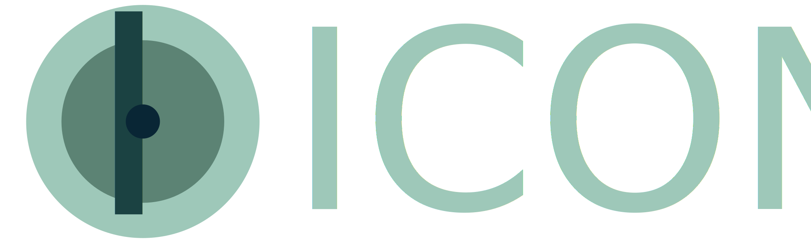
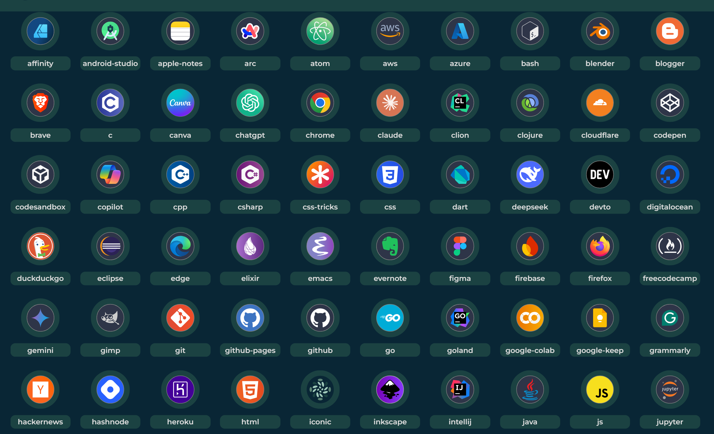

> Be iconic, not generic.  
> A dev-focused library of sleek, bubble-shaped skill icons built for GitHub READMEs, portfolios, and resumes.

---

<div align="center">
  


</div>

## ✨ Features

-   🟦 Bubble icons designed for clarity and aesthetics
-   🌙 Light & dark theme variants for every icon
-   🧩 Easy to embed in Markdown, HTML, or anywhere
-   ⚙️ HTML preview API with Django backend
-   💾 Download-ready SVGs

Here is a screenshot of several icons designed by ICONIC team.


---

## 🧪 Quick Implementation

Here's a sample of some icons:

```markdown
## HTML

<!-- Use div tag for good format and it will show them in one line, without div tag it will be displayed on multiple lines -->
<div style="display: flex; gap: 2px; align-items: center;">


<div>
```

> [!NOTE]  
> It's recommended to use the HTML snippet in GitHub READMEs, as it allows better control over size, styling, and layout.

### Dark:

<div style="display: flex; gap: 2px; align-items: center;">


  
<div>

### Light:

<div style="display: flex; gap: 2px; align-items: center;">


  
<div>

## 🚀 Getting Started (Dev Setup)

```bash
# Clone the repo
git clone https://github.com/YuheshPandian/ICONIC.git
cd ICONIC
```

---

## 🤝 Contributing

Have a new icon idea or want to help expand the collection?  
Pull requests are welcome!

-   Create your icon using a photo editing software (Inkscape preferred) and open the dark/light icon template and start editing.
-   Add the dual versions of icon in respective dark/light folders
-   Push the changes if completed

> Please follow the existing folder structure (`dark/` and `light/`), keep icon dimensions consistent (e.g., 512x512 SVG), and use meaningful file names.

---

## 📜 License

[MIT License](LICENSE)

---
